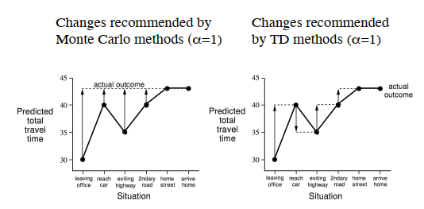

# RL Course, David Silver

## Lecture 3 - Planning by Dynamic Programming

DP requirements:

- Optimal Structure (recursive, decomposable) → Bellman Equations
- Overlapping Sub-problems → Value functions (store + reuse solutions)

Planning by DP:

- Prediction → MDP + $\pi$ or MRP → $v_\pi$
- Control → MDP → $v_\pi^*$

Policy Iteration:

- If improvement stops → reached Bellman Optimality → $v_\pi(s)=v_{\pi^*}(s)$

Policy Evaluation:

- k iterations → k=1 is Value Iteration
- $\epsilon$-convergence

Value Iteration:

- Principle of optimality:
    - $v_\pi(s)=v_{\pi^*}(s)$ iff for any $s'$ reachable from $s$, we have $v_\pi(s')=v_{\pi^*}(s')$
- If we know sub-problems $v_{\pi^*}(s')$ → do a one-step look-ahead to compute $v_{\pi^*}(s)$ (exact value of k-horizon value of state s under policy $\pi$)

$$
v_* (s) = max R^a_s + \gamma \sum_{s'\in S}P^a_{ss'} v_* (s')
$$

$$
v_{k+1}(s) = max R^a_s + \gamma \sum_{s'\in S}P^a_{ss'} v_{k}(s')
$$

Computational Complexity:

- V-based → $O(mn^2)$
- Q-based → $O(m^2n^2)$

DP uses full-width backups → not good for large problems (curse of dimensionality) → Use sample backups instead of reward functions and transition dynamics → model-free

Overview:

| Prediction | Bellman Expectation Equation | Iterative Policy Evaluation |
| --- | --- | --- |
| Control | Bellman Expectation Equation + Greedy Policy Improvement | Policy Iteration |
| Control | Bellman Optimality Equation | Value Iteration |
- Synchronous: needs old values and new values
- Asynchronous:
    - in-place : use only one set of values
    - Prioritized Sweeping: first update the state with the largest Bellman backup error        $|max(R^a_s + \gamma \sum_{s' \in S} P^a_{ss'} v(s'))-v(s)|$
    - real-time: Only update samples that happen in real-time (relevant to the agent)

Approximate DP:

- function approximator $\hat{v}(s, \boldsymbol w)$ → apply DP to $\hat{v}(s, \boldsymbol w)$ → for each state estimate target value function using Bellman optimality function, $\tilde{v}_k(s)$ → Train next value function $\hat{v}(., \boldsymbol w_{k+1})$ using targets from last step

## Lecture 4 - Model-Free Prediction

- Model-free prediction:
    - MC: Go all the way to the end of trajectory and estimate by looking at sample returns
    - TD-learning: Look one step ahead and estimate return after 1 step
        - $TD(\lambda)$ : any number of steps
- Before: Known MDP
    - Prediction
    - Control
- Now: Model-free:
    - Prediction : This lecture
    - Control: Next
- MC:
    - Only works for episodic experiences
    - Needs complete episodes and a terminating state
    - Uses empirical mean return (expectation over trajectories)
    - Two types:
        - 1st visit MC: Update once(first visit) for states in an episode
        - Every visit MC: Increment more than once in each episode
            - biased because rewards for multiple visits of the same state in a particular episode are correlated (vs i.i.d. across different states)
            - consistent and often better MSE
- Incremental MC updates
    - Use real mean
    - Use a constant for update (good for non-stationary)
- TD:
    - Learn from incomplete episodes by bootstrapping
    - Update a guess towards a guess
    - $v(s_t) = v(s_t) + \alpha(R_{t+1} + \gamma v(s_{t+1}) -v(s_t))$
    - $R_{t+1} + \gamma v(s_{t+1})$ is called TD target (TD(0))
    - $R_{t+1} + \gamma v(s_{t+1}) - v(s_t)$ is TD error $\delta_t$
- TD vs MC

- TD can learn before/without knowing the final outcome
- TD can work even in incomplete or continuing episodes.
- TD target (1 random action, transition, reward) induces less noise than the return (many random actions, transitions, rewards)
- TD has low variance, some bias, MC has high variance, zero bias:
    - more efficient than MC
    - TD(0) converges to true value function of policy
    - More sensitive to initial value unlike MC
    - MC works with function approximation but TD not always
- MC converges to the solution with minimum mean squared error: Best fit to observed returns → Does not exploit Markov property
- TD converges to the solution of maximum likelihood Markov model: Solution to the MDP that best fits the data → Exploits Markov property

|  | MC | DP | TD |
| --- | --- | --- | --- |
| Bootstrapping | No | Yes | Yes |
| Sampling | Yes | No | Yes |

- Best n can vary a lot in different settings → averaging n-step returns → $TD(\lambda)$

$$
G_t^{\lambda}=(1-\lambda)\sum_{n=1}^\infin \lambda^{n-1} G_t^{(n)}
$$

$$
v(s_t) = v(s_t) + \alpha(G_t^{\lambda}-v(s_t))
$$

This is the forward view which is like MC in the sense that it needs complete episodes.

The backward view however adds an additional memory to each state called the eligibility trace. The traces are said to indicate the degree to which each state is *eligible* for undergoing learning changes should a reinforcing event occur.

If TD(0) all traces are zero at t except for the trace corresponding to  $s_t$. TD(0) only the one state preceding the current state is changed by the TD error. For larger values of lambda, more preceding states are changed, but each more temporally distant state is changed less because its eligibility traces is smaller. If lambda=1 this corresponds to every visit MC but better because it doesn’t need to be episodic.

## Lecture 5 - Model Free Control

- On-policy → Learn on the job
- Off-policy → Learn following someone else’s policy

We might use model-free when:

- MDP is unknown, but experience can be sampled
- MDP is known, but too big to use, except by samples

Generalized Policy Iteration:

- Policy Evaluation: Use MC for value function → Problem → policy improvement over value function requires model of MDP → use Q(s, a)
- Policy Improvement: Improve greedily → Problem → Not explore entire state space → Use epsilon-greedy policy

Epsilon-greedy policy improvement is proven (Note: maximum of q(s, a) over actions is greater equal than any weighted sum of q(s, a) → because $\pi(a|s) \ge \epsilon/m$, we use a normalized of it as the weighted sum so that the terms cancel out and the improvement is proven)

- MC evaluation can happen every episode instead of generating lots of episodes just for episodes
- TD evaluation is even faster because it can be updated every time-step → SARSA

The Greedy in the Limit with Infinite Exploration (GLIE) theorem states:

- All state action pairs are explored infinitely many times
- The policy converges on a greedy policy

Epsilon-greedy is GLIE if epsilon reduces to zero at 1/k

GLIE MC Control

- Sample kth episode using policy $\pi$
- For each state $S_t$ and action $A_t$:
    - $N(S_t, A_t) \leftarrow N(S_t, A_t) + 1$
    - $Q(S_t,A_t) \leftarrow Q(S_t, A_t) + \frac{1}{N(S_t,A_t)}(G_t - Q(S_t,A_t))$
- Improve policy
    - $\epsilon \leftarrow 1/k$
    - $\pi \leftarrow \epsilon-greedy(Q)$

SARSA: $Q(S,A) \leftarrow Q(S,A) + \alpha (R+\gamma Q(S',A')-Q(S,A))$

Now following the previous lecture we can use n-step SARSA to account for n-step Q-returns and use a weighting of ($1-\lambda$) to account for the credit assignment → forward, backward view of SARSA($\lambda$) → $\lambda$ determines how much of the preceding states update

In backward view of $SARSA(\lambda)$, we use eligibility traces for each state-action pair.

Off-policy benefits:

- Learn from observing humans or other agents
- Reuse experience generated from old policies
- Learn about optimal/multiple policies while following exploratory/one policy

We should use importance sampling to estimate the expectation of the target policy from the behavior policy → off-policy MC because importance sampling corrections are multiplied along whole episode, therefore it cannot be used if one of the denominators is zero and also this method dramatically increase variance → Use TD

$V(S_t) \leftarrow V(S_t) + \alpha(\frac{\pi(A_t|S_t)}{\mu(A_t,S_t)} (R_{t+1} + \gamma V(S_{t+1}))-V(S_t))$

But in Q-learning no importance sampling is required because next action is chosen using behavior policy but we consider alternative successor action that maximizes Q.

- Maximization bias → Solution: Double Q Learning (two unbiased estimators, one for decision making and the other for value estimation)
- Target policy is greedy wrt Q
- Behavior policy is epsilon-greedy wrt Q
- $Q(S,A) \leftarrow Q(S,A) + \alpha (R+\gamma \max_{a'} Q(S',a')-Q(S,A))$
- Q-learning is like TD in the sense that only updates Q for the state it was in and not backprop info through the whole trajectory

## Lecture 6 - Value Function Approximation

Purpose:

- Too many state-action pairs to store in memory
- Too slow to learn them

Solution:

- Use function approximation to approximate state or state-action values
- With the idea of generalization from seen states to unseen states

Notes:

- Our method should be suitable for non-stationary, non-i.i.d. settings, which is the case of RL

$J(\boldsymbol{w})=E_{\pi}[(v_{\pi}(s)-\hat{v}(s,\boldsymbol{w}))^2] \rightarrow \Delta\boldsymbol{w}=\alpha (v_{\pi}(s)-\hat{v}(s,\boldsymbol{w}))\nabla_{\boldsymbol{w}} \hat{v}(s,\boldsymbol{w})$ Where stochastic gradient descent is used.

- Table lookup is a special case of linear value function approximation, where the feature vector has a 1 in the i’th position if it is in the state i and zero everywhere else.
- We don’t have access to the true value functions, so we use our policy evaluation methods from previous lectures like MC, TD:
    - MC: $G_t$
        - $\Delta\boldsymbol{w}=\alpha (G_t-\hat{v}(S_t,\boldsymbol{w}))\nabla_{\boldsymbol{w}} \hat{v}(S_t,\boldsymbol{w})$
        - Training data: $\{ <S_1, G_1>, <S_2, G_2>, ..., <S_T,G_T>\}$
    - TD(0): $R_{t+1}+\gamma \hat{v}(S_{t+1}, \boldsymbol w)$
        - $\Delta\boldsymbol{w}=\alpha (R_{t+1}+\gamma \hat{v}(S_{t+1}, \boldsymbol w)-\hat{v}(S_t,\boldsymbol{w}))\nabla_{\boldsymbol{w}} \hat{v}(S_t,\boldsymbol{w})$
        - $\hat{v}(S_{t+1}, \boldsymbol w)$ is biased
        - Training data: $\{ <S_1, R_{2}+\gamma \hat{v}(S_{2}, \boldsymbol w)>, <S_2, R_{3}+\gamma \hat{v}(S_{3}, \boldsymbol w)>, ..., <S_{T-1},R_T>\}$
        - Linear TD(0) converges (close) to global optimum
    - TD($\lambda$):
        - $\Delta\boldsymbol{w}=\alpha (G_t^{\lambda}-\hat{v}(S_t,\boldsymbol{w}))\nabla_{\boldsymbol{w}} \hat{v}(S_t,\boldsymbol{w})$
        - Training data: $\{ <S_1, G_1^{\lambda}>, <S_2, G_2^{\lambda}>, ..., <S_{T-1},G_{T-1}^{\lambda}>\}$
        - Backward view of linear TD($\lambda$):
            - $\delta_t = R_{t+1} + \gamma \hat v (S_{t+1}, \boldsymbol w) - \hat v (S_t, \boldsymbol w)$
            - $E_t = \gamma \lambda E_{t-1} + \boldsymbol x (S_t)$ → Add feature vector
            - $\Delta \boldsymbol w = \alpha \delta_t E_t$
            - $G_t^{\lambda}$ is also a biased sample of true value function

Let’s see what we can do now:

- Policy evaluation using approximate policy evaluation $\hat q (.,.,\boldsymbol w) \approx q_{\pi}$
- Policy improvement using epsilon-greedy improvement

- TD does not follow the gradient of any objective function so it diverges in most cases. Gradient TD follows true gradient of projected Bellman error towards the TD fixed point.
- VFA + off-policy (importance sampling) + bootstrapping may and will fail to converge

GD is simple but sample inefficient → Use batch GD given the agent’s experience

SGD with Experience Replay:

1. Sample state, value from experience: $<s,v^{\pi}> \sim \mathcal D$
2. Apply SGD update: $\alpha (v^{\pi}-\hat{v}(s,\boldsymbol{w}))\nabla_{\boldsymbol{w}} \hat{v}(s,\boldsymbol{w})$

Converges to LS solution: $\boldsymbol w^\pi = \argmin_{\boldsymbol w} LS(\boldsymbol w)$

DQN: Uses Experience Replay + Fixed Q-Targets

- Take $a_t$ according to $\epsilon$-greedy policy
- Store transitions SARS in replay memory $\mathcal D$
- Sample random minibatch of transitions SARS from $\mathcal D$
- Compute Q-learning targets wrt frozen, fixed parameters $\boldsymbol w^-$
- Optimize MSE between Q-network and frozen Q-learning targets
    
    $\mathcal L_i(w_i) = \mathbb E_{s,a,r,s' \sim \mathcal D_i}[(r+\gamma \max_{a'} Q(s',a';w_i^-)-Q(s,a;w_i))^2]$
    
- Using variant of SGD
- The uniform sampling from replay buffer gives equal importance to all stored experiences unlike Prioritized Replay which replays important transitions more frequently (Updates samples with more DQN error with more probability)

Experience replay finds LS solution but may take long → use linear value function approximation to derive closed-form solution

Now $v_t^\pi$ is different for different methods: MC, TD(0), TD($\lambda$)

Now:

- Policy evaluation using LS Q-learning
- Policy improvement by greedy policy improvement

Double DQN: The greedy action is generated according to the online network with parameters w, but its value is estimated by the target network with parameters w−.

$\mathcal L_i(w_i) = \mathbb E_{s,a,r,s' \sim \mathcal D_i}[(r+\gamma Q(s',\argmax_{a'}Q(s,a;w_i);w_i^-)-Q(s,a;w_i))^2]$

Dueling DQN: Separate the output streams in two: one used to measure state value and the other to measure the advantage of taking each action. It may be more efficient to learn the value of being in a particular state independently of the advantages of the different actions, and then combine that value with the advantages to compute the Q-value function. By doing so, the algorithm can more easily identify the importance of different actions in different states, which can lead to more efficient learning and better performance.

To solve the identifiability problem in calculating Q, we can force the advantage function to have zero estimate at the chosen action, although the authors used an averaging of the advantages instead of the max

## Lecture 7 - Policy Gradient Methods

- Use policy directly instead of working with value functions → change in the direction to make it better from experience
- $\pi_\theta(s,a)=P(a|s,\theta)$ → Parametrize policy (model-free)

Advantages:

- Better convergence properties
- Effective in high-dimensional settings or continuous action spaces (where max operator is expensive or adds too much actions to update)
- Can learn stochastic policies (like rock-paper-scissors)

Disadvantages:

- Typically converges to local rather than global optimum
- Policy evaluation is typically inefficient and high variance

Where it might be useful:

- Stochastic policy is optimal
- State aliasing or POMDP (representing environment with limited features)

Our goal with policy-gradient is to **control the probability distribution of actions** by tuning the policy such that **good actions (that maximize the return) are sampled more frequently in the future.** Each time the agent interacts with the environment, we tweak the parameters such that good actions will be sampled more likely in the future.

Policy Objective Functions:

- Start value: $J_1(\theta)=V^{\pi_\theta}(s_1)=\mathbb E_{\pi_\theta} [v_1]$
- Average value for continuing environments: $J_{avV}(\theta)=\sum_s d^{\pi_\theta}(s) V^{\pi_\theta}(s)$
- Average reward per time-step: $J_{avR}(\theta)=\sum_s d^{\pi_\theta}(s) \sum_a \pi_\theta (s,a) \mathcal R^a_s$
- $d^{\pi_\theta}(s)$ is stationary distribution of Markov chain for $\pi_\theta$

There are many approaches to solve this optimization problem → We focus on gradient methods.

- Finite Differences → Estimate kth partial derivative of objective w.r.t. $\theta$ by perturbing it by small amount $\theta$  in kth dimension.
    - Simple, noisy, inefficient but sometimes affective
    - Even works for non-differentiable
- Analytically
    - Likelihood ratios: $\nabla_\theta \pi_\theta(s,a) = \pi_\theta(s,a) \frac{\nabla_\theta \pi_\theta(s,a)}{\pi_\theta(s,a)}=\pi_\theta(s,a)\nabla_\theta \log{\pi_\theta(s,a)}$ → Score function
        - Softmax policy: probability of action proportional to exponentiated weights: $\pi_\theta(s,a) \propto e^{\phi(s,a)^T\theta}$ →  $\nabla_\theta \log{\pi_\theta(s,a)} = \phi(s,a) - \mathbb E_{\pi_\theta}[\phi(s,.)]$
        - Gaussian policy: good for continuous action spaces
            - Mean is a linear combination of state features: $\mu(s)=\phi(s)^T\theta$
            - Variance can be fixed or also parametrized
            - Policy $a \sim \mathcal N(\mu(s),\sigma^2)$ → $\nabla_\theta \log{\pi_\theta(s,a)} = \frac{(a-\mu(s))\phi(s)}{\sigma^2}$

Policy Gradient Theorem: $J=J_1,J_{avR},\frac{1}{1-\gamma}J_{avV}$ → Derived from expanding last one and replacing the instaneous reward with long-term value Q

$$
\nabla_\theta J(\theta) = \mathbb E_{\pi_\theta}[\nabla_\theta \log{\pi_\theta(s,a)} Q^{\pi_\theta}(s,a)]
$$

REINFORCE (using return $v_t$ as an unbiased sample of Q)

REINFORCE algorithm still suffers from high variance because of using the return as a sample of Q → Use a critic to estimate action-value function $Q_w (s,a) \approx Q_{\pi_\theta}(s,a)$

- Critic: Updates action-value function parameters $w$ → Policy evaluation
- Actor: Updates policy parameters $\theta$, in direction suggested by critic
- $\nabla_\theta J(\theta) \approx \mathbb E_{\pi_\theta}[\nabla_\theta \log{\pi_\theta(s,a)} Q_w(s,a)]$
- $\Delta\theta = \alpha\nabla_\theta \log{\pi_\theta(s,a)} Q_w(s,a)$

QAC (linear TD(0))

Approximating the policy gradient introduces bias (by minimizing the objective in value function approximation we may get stuck in local minimum which is biased for the policy update) 

Compatible Function Approximation Theorem:

- Value function approximator is compatible to the policy = gradient of Q network w.r.t. its weights is equal to gradient of score function w.r.t. its weights
- Value function parameters minimize the MSE

Then the policy gradient is exact

To reduce variance of the actor-critic algorithm we substract a baseline from the policy gradient. A good baseline is $B(s)=V^{\pi_\theta}(s)$ → Now the policy gradient is called the Advantage function $A^{\pi_\theta}(s,a)$ → We can estimate this using two parameter vectors, one for Q and one for V → We only need to approximate TD error for approximating V, because taking the expectation of the TD error is exactly equal to the advantage function

We can estimate policy gradient from many targets at different time-scales: MC, TD(0), TD($\lambda$)

Gradient ascent algorithms can follow any ascent algorithms.

## Lecture 8 - Integrating Learning and Planning

- Simulation-based search → architectures where you have some agent that imagines what’s going to happen in future and learns from that imagined experience to perform better

Before:

- Learn value functions from experience
- Learn policy from experience

Now:

- Learn model from experience → use planning to construct value function or policy
- Integrate learning + planning into a single architecture

Example:

In the chess game if you move one piece from one state to the other, you might experience a sharp change in the value function (win → lose). This is also very hard for the agent to learn the value function.

Advantages:

- Efficiently learn a model by supervised learning
- Reason about model uncertainty

Disadvantages:

- First learn a model then construct a value function → two sources of error

Parametrize the model $\mathcal{M=<P_\eta,R_\eta>}$ represents the state transitions and reward. Then estimate it from experience. Learning reward is a regression problem and the next state is density estimation.

Examples of Models:

- Table Lookup Model: update by counting visits to each state-action pair
- Linear expectation model
- Linear Gaussian Model
- Gaussian Process Model
- Deep Belief Network Model

Sample-Based Planning:

- Use model to generate samples
- Sample experience from the model
- Apply model-free RL to samples: MC control, SARSA, Q-learning

Model-based RL performance is as good as the estimated model

Solutions:

1. Use model-free RL when model is wrong
2. Reason explicitly about model uncertainty

There are two sources of experience: Real and simulated. 

- Model-free RL: learn value function/policy from real experience
- Model-based RL:
    - learn model from real experience
    - plan value function/policy from simulated experience
- Dyna
    - learn model from real experience
    - learn and plan value function/policy from real and simulated experience
        
        
        

Simulation-based search:

- We want to use forward search paradigm using sample-based planning
- Simulate episodes of experience from now with the model

- Apply model-free RL to simulated episodes:
    - MC control → MC search
    - SARSA → TD search

MC Tree Search:

- Simulate K episodes from current state using current simulation policy
- Build a search policy tree containing visited states and actions
- Evaluate state-action pairs by mean return of episodes from there
- After search is finished, select current (real) action with maximum value in search tree.

MCTS have 2 phases:

- In-tree: pick actions to maximize Q
- Out-of-tree: pick actions randomly

Then after the simulation:

- Evaluate state-action pairs by MC evaluation
- Improve tree policy: by epsilon-greedy(Q)

We can use TD in the evaluation of state-action pairs

**Learning from simulated experience is an effective method to search**

## Lecture 9 - Exploration and Exploitation

Principles:

- Naive Exploration: add noise to greedy policy (epsilon greedy)
- Optimistic Initialization
- Optimism in the face of uncertainty
- Probability matching
- Information state search

Multi-armed bandits don’t have states, only actions and rewards

Regret is a function of gaps and the counts → a good algorithm ensures small counts for large gaps

We are looking for algorithms with sublinear regret. 

- Greedy and epsilon greedy algorithms can lock onto a suboptimal action forever and result in a linear regret
- Optimistic initialization encourages exploration but still can lock onto suboptimal action
- Decay epsilon greedy: logarithmic asymptotic total regret
    - Requires gaps knowledge
- Optimism in the face of uncertainty
    - UCB: small N(a) → large U(a) (uncertain), large N(a) → small U(a)
    - Select action maximizing UCB (UCB1 when applying Hoeffding’s inequality to rewards and reducing p as we observer more rewards)
        
        
        
        
        
- Bayesian Bandits exploit prior knowledge → compute posterior of rewards → better performance if prior is accurate
    - Bayesian UCB
        - Assume reward distribution is Gaussian
        - Compute posterior after observing history
        - Pick action with most possible reward
            
            
            
    - Probability Matching: select action with the highest probability of being optimal
        
        
        
        - Thompson sampling:
            - Compute posterior distribution using Bayes law
            - Sample a reward distribution from posterior
            - Compute action value function
            - Select action maximizing value on sample
        
        
        
    
    
    
    Bernoulli bandit with initial Beta(1, 1) priors
    
    - Information State Space: quantify information gain, trade-off exploration-exploitation optimally.
        - View multi-armed bandits as sequential decision making problem where each step is an information state and each action causes a transition to a new information state (Infinite MDP over information states → Many ways to be solved)
            - Example of Bayes-adaptive Bernoulli bandits
            
            
            

Every method can also be applied to MDP:

- Optimistic initialization: Initialize state-action values to $r_{max}/(1-\gamma)$
- Using UCB and maximizing action-value function may not be optimal because the policy is improving → we can add two upper confidence bounds, one for policy evaluation and one for policy improvement
- …

## Imitation Learning

- RL is mostly good when rewards are dense in time and data gathering is cheap and parallelization is easy
- IL is useful when it is easier to demonstrate the behavior rather than specifying it with a reward
- Given:
    - State and action spaces
    - Transition model
    - No reward function
    - Set of one or more of teacher’s demonstrations
- Behavioral Cloning
    - Learn the teacher’s policy directly with supervised learning
    - Challenges
        - SL assumes i.i.d. data and ignores temporal structure
        - Compounding errors: actions determine data you’re gonna see
    - DAGGER: Dataset Aggregation
        - Get more labels of the expert action along the path taken by the learned policy
    
    
    
- Inverse RL
    - Recover R
        - Even if teacher’s policy is optimal the recovered R is not unique. e.g. it can be a constant zero
        - Consider reward is linear over features
        
        
        
        - The last term is defined as the discounted weighted frequency of state features under policy $\pi$
- Apprenticeship learning via IRL
    - Use R to generate a good policy
    
    
    
    - 
    
    
    
    - Infinite number of reward functions with the same optimal policy
    - Infinite stochastic policies that an match feature counts
    - Maximum Entropy IRL
    - Generative Adversarial Imitation Learning GAIL